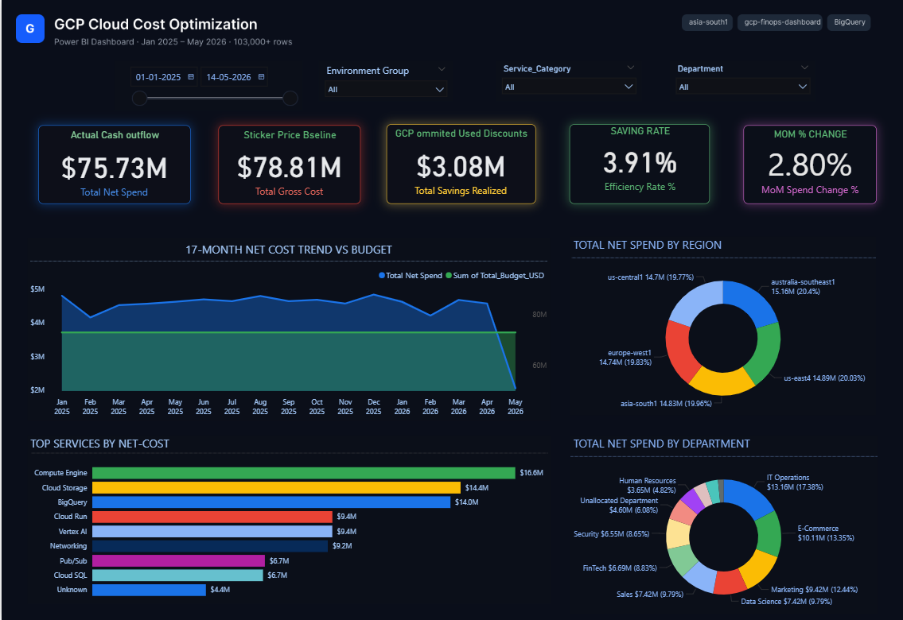

Dashboard/1. Executive.png
# 📊 GCP Cloud Cost Optimization & FinOps Analytical Framework

## 🚀 Project Overview
This repository contains an end-to-end FinOps governance framework designed to bridge the structural gap between cloud engineering operations and corporate financial accountability. By connecting **Power BI (DirectQuery mode)** live to a **Google BigQuery** data warehouse via optimized SQL views, this architecture processes over **103,000 active records** to enforce real-time cost transparency and waste mitigation.

---

## 🏗️ Core Architecture Components
* **6-Tier Analytical Model:** Relational Star Schema designed to cross-filter across *Corporate Departments, Global Regions, Environment Tiers, GCP Service Ecosystems, Granular SKU Components, and Statistical Utilization Layers*.
* **Statistical Anomaly Tracking:** Advanced DAX models implementing 7-day rolling averages and standard deviation thresholds to automatically isolate unexpected daily spend spikes.
* **Corporate Chargeback Ledger:** Dynamic Department $\times$ Environment matrix tracing infrastructure spending back to specific engineering owners, flagging **$3.46M in potential asset waste**.
* **Performance Optimization:** Aggregated BigQuery SQL views designed to eliminate query folding degradation and handle **6.22M Compute Engine hours** and **5.11M BigQuery data-scanned metrics** with low-latency page rendering.

---

## 🛠️ Tech Stack & Skills
* **Business Intelligence:** Power BI Desktop (DirectQuery, Advanced DAX, Star Schema Modeling)
* **Data Warehousing:** Google BigQuery
* **Query Language:** SQL (Views, Aggregations, Data-Grain Alignment)

---

## 🖥️ Dashboard Architecture & Interface Walkthrough

Below is the complete 8-page interactive interface breakdown showcasing the technical and strategic layers of the framework.

### 📍 Page 1: Executive Cost Summary
* **Focus:** High-level overview of global infrastructure spend, tracking actual cash outflow ($75.73M Net Spend) alongside realizing a 3.91% efficiency saving rate.
* **Key Metric:** 17-Month Net Cost Trend vs. Budget baseline.

---

### 📍 Page 2: Service & SKU Category Cost Breakdown
* **Focus:** Granular cost allocation mapping services to infrastructure environments. Tracks total multi-tenant expenditures across specific product families (Compute, Storage & Databases, Analytics).
* **Key Metric:** Core Service Categories (Compute Engine leading at $16.82M).

---

### 📍 Page 3: Compute Engine & Infrastructure Auditing
* **Focus:** Tracking infrastructure runtimes, storage volumes, and engine resource types. Correlates instance utilization profiles (such as M1-Ultra-96 and Training-A100) directly against running net costs.
* **Key Metric:** Cumulative Runtime Totals (6.22M Compute Hours & 5.11M BigQuery Data Scanned).

---

### 📍 Page 4: BigQuery Slots & Network Cost Audit
* **Focus:** Deep-dive mapping of data warehouse analytics costs and concurrent network data transfer volume (GB) categorized by specific corporate departments.
* **Key Metric:** BigQuery Analysis & Cumulative Networking Cost ($2.04M Total Network Cost).

---

### 📍 Page 5: Team Chargeback & Environment Matrix
* **Focus:** Fully cross-filtered interactive Corporate Matrix mapping untagged or unallocated resources strictly down to their operational lifecycle tiers (Production, Dev, Test, Sandbox, Staging) to enforce organizational chargebacks.
* **Key Metric:** True Budget Utilization Velocity accurately aligned at **103.88%**.

---

### 📍 Page 6: Idle Resources & Zombie Asset Waste
* **Focus:** Active governance monitor isolating infrastructure assets operating at financial risk. Tracks run-rate savings, percentage of wasted spend, and maps active clusters using a dual-axis efficiency plot.
* **Key Metric:** Zombie Asset Waste identifying **$3.46M in Idle Resource Costs**.

---

### 📍 Page 7: Portfolio Budget vs. Actual Spend
* **Focus:** Dynamic budget tracking mechanisms tracing project-level metrics against contractual baselines. Implements automated RAG status warnings to flag at-risk profiles.
* **Key Metric:** Portfolio Burn Rates ($75.12M Spent vs. $72.90M Target Baseline).

---

### 📍 Page 8: Statistical Cost Anomaly Detection
* **Focus:** Active forensic layer modeling network daily trends and egress traffic using custom 7-day rolling averages to surface, flag, and contain unexpected immediate spending spikes.
* **Key Metric:** Isolated Anomaly Incidents (14 True Spike Incidents identified).

---

## ⚠️ Data Privacy & Compliance Disclaimer
To comply with strict cloud data privacy regulations and protect confidentiality, this framework was validated and benchmarked using a structurally modeled, **synthetic generated dataset**. It perfectly mirrors a multi-tenant enterprise GCP footprint, ensuring all DAX engines, relationship paths, and DirectQuery loops are 100% production-ready without exposing sensitive live data.
